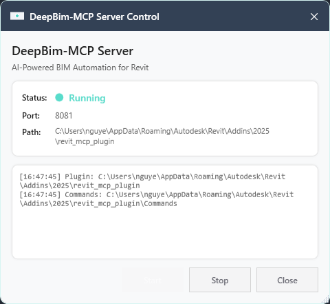
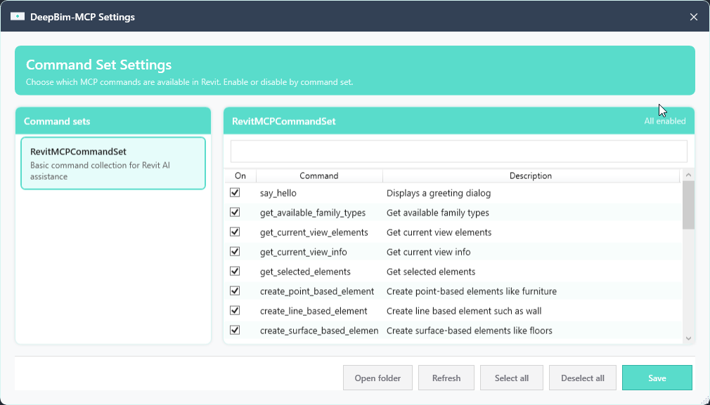

# DeepBim-MCP

**AI-Powered BIM Automation for Autodesk Revit via the Model Context Protocol.**

DeepBim-MCP enables AI assistants like Claude, Cursor, and other MCP-compatible tools to interact with Revit projects. It consists of three components: a TypeScript MCP server that exposes tools to AI clients, a C# Revit add-in that bridges commands into Revit, and a command set that implements the Revit API operations.

> **Acknowledgement:** This project references and draws inspiration from the architecture of [mcp-servers-for-revit](https://github.com/mcp-servers-for-revit/mcp-servers-for-revit). We recommend reviewing their codebase for additional patterns and tool implementations.

## Architecture

flowchart LR
    A["AI Client<br/>(Claude, etc.)"]
    B["MCP Server<br/>(Node.js)"]
    C["Revit Plugin<br/>(C# Add-in)"]
    D["Command Set<br/>(Revit API)"]

    A <--> |stdio| B
    B <--> |TCP<br/>8080-8099| C
    C --> D

- **MCP Server** (TypeScript): Translates tool calls from AI clients into TCP messages
- **Revit Plugin** (C#): Runs inside Revit, listens on port 8080–8099, dispatches to Command Set
- **Command Set** (C#): Executes Revit API operations and returns results

## Requirements

- **Node.js 18+** (for the MCP server)
- **Autodesk Revit 2025** (or compatible version)
- **.NET 8** (for plugin and command set)

## Quick Start

### 1. Build the Project

```bash
# Build MCP Server
cd server
npm install
npm run build

# Build Plugin + Command Set (Visual Studio or dotnet CLI)
# Open revit-mcp-plugin.sln and build, or:
dotnet build revit-mcp-plugin.sln -c Debug
```

### 2. Install the Revit Add-in

Run the setup script (or copy manually):

```powershell
.\setup-revit-addin.bat
```

Or copy the contents of `plugin\bin\AddIn 2025 Debug\` to:

```
%AppData%\Autodesk\Revit\Addins\2025\
├── DeepBimRevitMCPlugin.addin
└── DeepBimRevitMCPlugin\
    ├── RevitMCPPlugin.dll
    ├── Commands\
    │   ├── commandRegistry.json
    │   └── RevitMCPCommandSet\
    │       ├── command.json
    │       └── 2025\
    │           └── RevitMCPCommandSet.dll
    └── server\
        ├── index.js
        ├── node_modules\   # present when installed from MSI (production deps)
        ├── database\
        ├── tools\
        └── utils\
```

### 3. Start Revit

1. Open Revit 2025 and load a project
2. Go to **Add-Ins** tab → **DeepBim-MCP** → **Server** panel → click **Connect Server**
3. In the **DeepBim-MCP Server Control** window, click **Start** (or it may auto-start)
4. Verify status shows **Running** and note the port (e.g. 8081) and plugin path

### 4. Configure MCP clients (Claude, Cursor, others)

Point your MCP client at the Node entry file using **`command`: `node`** and a **single absolute path** in `args`. Use **escaped backslashes** (`\\`) in JSON on Windows.

#### After add-in install (MSI or copy into Revit Add-ins)

The MCP server is bundled next to the add-in. Path pattern:

```text
%AppData%\Autodesk\Revit\Addins\<RevitYear>\DeepBimRevitMCPlugin\server\index.js
```

`<RevitYear>` is the Revit version folder you installed into (`2024`, `2025`, `2026`, …).

Example (Revit 2025, user `alex`):

```text
C:\Users\alex\AppData\Roaming\Autodesk\Revit\Addins\2025\DeepBimRevitMCPlugin\server\index.js
```

Keep the whole `server\` folder intact (`node_modules`, `tools`, etc.); only reference **`index.js`**.

**Before using tools:** Node.js must be on `PATH`, Revit must be open, and **DeepBim-MCP → Connect Server** must be **Running** so the plugin listens on TCP 8080–8099.

**Claude Desktop** — edit `%AppData%\Claude\claude_desktop_config.json`:

```json
{
  "mcpServers": {
    "deepbim-mcp-server": {
      "command": "node",
      "args": [
        "C:\\Users\\alex\\AppData\\Roaming\\Autodesk\\Revit\\Addins\\2025\\DeepBimRevitMCPlugin\\server\\index.js"
      ]
    }
  }
}
```

**Cursor** — same shape in MCP settings (e.g. project or user `.cursor/mcp.json`).

**Other MCP-compatible editors** — same `command` / `args` pattern.

**Multiple Revit versions** — each year has its own `Addins\<year>\` tree and its own `...\server\index.js`. Point `args` at the install that matches the Revit session you use, or define separate server names for each year.

#### From a development clone (repository)

Build first (`npm run build` in `server/`), then use the compiled file under the repo:

```json
{
  "mcpServers": {
    "deepbim-mcp-server": {
      "command": "node",
      "args": ["D:\\src\\revit-mcp-plugin\\server\\build\\index.js"]
    }
  }
}
```

| Scenario | Typical `args` path |
|----------|---------------------|
| Installed add-in | `%AppData%\...\Addins\<year>\DeepBimRevitMCPlugin\server\index.js` |
| Local development | `<repo>\server\build\index.js` |

Fully quit and restart the IDE after changing MCP config. In Claude Desktop, a 🔨 icon indicates the MCP server loaded.

## Plugin UI

### Server Control

The **DeepBim-MCP Server Control** window shows the MCP server status, listening port, and plugin/commands paths. Use **Start** / **Stop** to control the connection that AI clients use to talk to Revit.



### Settings — Command Set

**DeepBim-MCP Settings** → **Command Set Settings** lets you choose which MCP commands are available in Revit. Enable or disable entire command sets, or individual commands (e.g. `say_hello`, `get_current_view_info`, `export_sheets_to_excel`). Use **Open folder**, **Refresh**, **Select all** / **Deselect all**, then **Save** to apply.



## Supported Tools

| Tool                  | Description                                    |
| --------------------- | ---------------------------------------------- |
| `say_hello`           | Display a greeting dialog (connection test)    |
| `get_view_info`       | Get current active view information            |
| `get_selected_elements` | Get currently selected elements in Revit    |

## Project Structure

```
revit-mcp-plugin/
├── revit-mcp-plugin.sln
├── command.json              # Command set manifest
├── server/                   # MCP server (TypeScript)
│   ├── src/
│   │   ├── index.ts
│   │   ├── tools/            # Tool definitions
│   │   └── utils/            # Connection manager, socket client
│   └── build/
├── plugin/                   # Revit add-in (C#)
│   ├── Core/                 # SocketService, CommandManager, etc.
│   ├── UI/                   # MCP Status Window, Settings
│   └── Configuration/
├── commandset/               # Command implementations (C#)
│   ├── Commands/
│   └── Services/
├── setup-revit-addin.ps1     # Deploy script
├── test-connection.ps1       # Test TCP connection
└── CLAUDE-SETUP.md           # Detailed Claude setup guide
```

## Connection Flow

1. **Revit** must be running with the plugin **Started** (MCP Switch → Start)
2. **MCP Server** auto-discovers the plugin on ports 8080–8099
3. **Claude** calls a tool → MCP Server connects to Revit → Plugin executes → Result returned

## Troubleshooting

- **"Method not found"**: Ensure `commandRegistry.json` exists in `Commands/` and the Command Set DLL is in `Commands/RevitMCPCommandSet/2025/`
- **"No DeepBim-MCP server found"**: Revit plugin not started — open MCP Switch and click Start
- **"No matching tools found"**: Claude config incorrect or Claude not restarted — check `claude_desktop_config.json` and restart Claude

See [CLAUDE-SETUP.md](CLAUDE-SETUP.md) and [KET-NOI-CLAUDE-REVIT.md](KET-NOI-CLAUDE-REVIT.md) for detailed setup and connection guides.

## Reference

This project is inspired by and references the following open-source project:

- **[mcp-servers-for-revit](https://github.com/mcp-servers-for-revit/mcp-servers-for-revit)** — Sparx fork with extensive tools for Revit automation via MCP. We recommend exploring their codebase for additional patterns, tool implementations, and best practices.

## License

MIT
